# System Architecture Documentation

本文档详细描述了多用户协作文档系统的架构设计、工作流程和功能设计。

## 目录

- [系统架构概览](#系统架构概览)
- [部署架构](#部署架构)
- [核心工作流程](#核心工作流程)
- [功能模块设计](#功能模块设计)
- [数据流设计](#数据流设计)
- [技术实现细节](#技术实现细节)

---

## 系统架构概览

### 整体架构图


### 层次架构

```mermaid
graph LR
    subgraph "表现层 Presentation"
        A[React Components]
        B[TipTap Editor]
        C[Yjs Client]
    end

    subgraph "业务层 Business"
        D[API Handlers]
        E[Auth Service]
        F[Permission Service]
    end

    subgraph "数据层 Data"
        G[PostgreSQL]
        H[Redis Cache]
    end

    subgraph "实时层 Real-time"
        I[Y-WebSocket]
        J[CRDT Sync]
    end

    A --> D
    B --> I
    C --> J
    D --> G
    D --> H
    I --> D
```



---

## 部署架构

### 云端部署架构


### 生产环境部署拓扑 (ASCII)

```
┌─────────────────────────────────────────────────────────────────┐
│                         Client Layer                            │
├─────────────────────────────────────────────────────────────────┤
│                     ┌────────────────┐                          │
│                     │    Browser     │                          │
│                     └───────┬────────┘                          │
│                             │                                   │
│              ┌──────────────┼──────────────┐                    │
│              │ HTTPS        │ WSS          │                    │
│              ▼              │              ▼                    │
│   ┌──────────────────┐      │    ┌──────────────────┐          │
│   │  Next.js Frontend│      │    │  Y-WebSocket     │          │
│   │  (Vercel)        │      │    │  (Railway)       │          │
│   └────────┬─────────┘      │    └────────┬─────────┘          │
│            │                │             │                     │
└────────────┼────────────────┼─────────────┼─────────────────────┘
             │                │             │
             │ HTTPS          │             │ HTTP (internal)
             ▼                │             ▼
┌─────────────────────────────┼───────────────────────────────────┐
│                    Backend Layer                                │
├─────────────────────────────┼───────────────────────────────────┤
│            ┌────────────────┴───────────────┐                   │
│            │       Go API Server            │                   │
│            │       (Railway)                │                   │
│            │       Port: 8080               │                   │
│            └───────────┬────────────────────┘                   │
│                        │                                        │
│         ┌──────────────┼──────────────┐                        │
│         │              │              │                        │
│         ▼              ▼              ▼                        │
│  ┌────────────┐ ┌────────────┐ ┌────────────┐                  │
│  │ PostgreSQL │ │   Redis    │ │ JWT Auth   │                  │
│  │ (Supabase) │ │ (Railway)  │ │ Middleware │                  │
│  └────────────┘ └────────────┘ └────────────┘                  │
│                                                                 │
└─────────────────────────────────────────────────────────────────┘

┌─────────────────────────────────────────────────────────────────┐
│                      Service Details                            │
├─────────────────────────────────────────────────────────────────┤
│                                                                 │
│  ┌────────────────┐      Frontend (Vercel)                      │
│  │  Next.js 14    │  ← 自动 CI/CD, 全球 CDN                      │
│  │  SSR + CSR     │  ← https://cswuncollabdocs.vercel.app       │
│  └────────────────┘                                             │
│                                                                 │
│  ┌────────────────┐      API Server (Railway)                   │
│  │  Go + Gin      │  ← RESTful API                              │
│  │  Port 8080     │  ← JWT 认证, 权限控制                        │
│  └────────────────┘                                             │
│                                                                 │
│  ┌────────────────┐      WebSocket (Railway)                    │
│  │  Y-WebSocket   │  ← 实时协作, CRDT 同步                       │
│  │  Port 1234     │  ← 文档持久化到 API                         │
│  └────────────────┘                                             │
│                                                                 │
│  ┌────────────────┐      Database (Supabase)                    │
│  │  PostgreSQL 15 │  ← 托管数据库                                │
│  │  + pgBouncer   │  ← 连接池                                   │
│  └────────────────┘                                             │
│                                                                 │
│  ┌────────────────┐      Cache (Railway)                        │
│  │  Redis 7       │  ← 会话缓存 (预留)                           │
│  │                │  ← Pub/Sub (预留)                           │
│  └────────────────┘                                             │
│                                                                 │
└─────────────────────────────────────────────────────────────────┘
```

### 本地开发架构


---

## 核心工作流程

### 1. 用户认证流程

```mermaid
sequenceDiagram
    participant User as 用户
    participant FE as Frontend
    participant API as Go API
    participant DB as PostgreSQL

    User->>FE: 访问登录页面
    User->>FE: 输入邮箱和密码
    FE->>API: POST /api/auth/login
    API->>DB: 查询用户 (email)
    DB-->>API: 返回用户数据
    API->>API: 验证密码 (bcrypt)
    API->>API: 生成 JWT Token
    API-->>FE: 返回 {token, user}
    FE->>FE: 存储 token 到 localStorage
    FE-->>User: 跳转到文档列表
```



### 2. 实时协作流程

```mermaid
sequenceDiagram
    participant User1 as 用户 A
    participant User2 as 用户 B
    participant FE1 as Frontend A
    participant FE2 as Frontend B
    participant YWS as Y-WebSocket
    participant API as Go API
    participant DB as PostgreSQL

    Note over User1,DB: 文档打开阶段
    User1->>FE1: 打开文档
    FE1->>YWS: WebSocket 连接 (/docId)
    YWS->>API: GET /api/yjs/:docId/snapshot
    API->>DB: 查询最新快照
    DB-->>API: 返回 snapshot
    API-->>YWS: 返回 base64 snapshot
    YWS->>YWS: 应用快照到 Yjs Doc
    YWS-->>FE1: 同步文档状态

    Note over User1,DB: 协作编辑阶段
    User1->>FE1: 编辑文档内容
    FE1->>FE1: Yjs 生成 update
    FE1->>YWS: 发送 update
    YWS->>YWS: 广播给其他用户
    YWS-->>FE2: 发送 update
    FE2->>FE2: 应用 update
    FE2-->>User2: 显示更新内容

    Note over User1,DB: 持久化阶段
    YWS->>YWS: 定期保存 (writeState)
    YWS->>API: POST /api/yjs/:docId/snapshot
    API->>DB: 保存新版本快照
    DB-->>API: 确认保存
```



### 3. 文档权限管理流程

```mermaid
sequenceDiagram
    participant Owner as 文档所有者
    participant Viewer as 请求者
    participant FE as Frontend
    participant API as Go API
    participant DB as PostgreSQL

    Note over Owner,DB: 权限请求阶段
    Viewer->>FE: 访问文档 (无权限)
    FE->>API: POST /api/docs/:id/access-request
    API->>DB: 创建 access_request
    DB-->>API: 确认创建
    API-->>FE: 返回请求状态

    Note over Owner,DB: 权限审批阶段
    Owner->>FE: 查看通知铃铛
    FE->>API: GET /api/access-requests/pending
    API->>DB: 查询待处理请求
    DB-->>API: 返回请求列表
    API-->>FE: 展示请求列表
    Owner->>FE: 批准请求
    FE->>API: PUT /api/access-requests/:id
    API->>DB: 更新请求状态 + 创建权限
    DB-->>API: 确认更新
    API-->>FE: 返回成功

    Note over Owner,DB: 访问阶段
    Viewer->>FE: 再次访问文档
    FE->>API: GET /api/docs/:id
    API->>DB: 验证权限
    DB-->>API: 权限通过
    API-->>FE: 返回文档内容
```



### 4. 评论系统流程

```mermaid
sequenceDiagram
    participant User as 用户
    participant FE as Frontend
    participant Editor as TipTap Editor
    participant API as Go API
    participant DB as PostgreSQL

    User->>Editor: 选择文本
    Editor->>FE: 显示选择菜单
    User->>FE: 点击添加评论
    FE->>FE: 记录选区位置 {anchor, head}
    User->>FE: 输入评论内容
    FE->>API: POST /api/docs/:id/comments
    Note right of API: {content, selection}
    API->>DB: 创建评论记录
    DB-->>API: 返回评论 ID
    API-->>FE: 返回完整评论
    FE->>FE: 更新评论侧边栏
    FE->>Editor: 高亮选区文本
```



---

## 功能模块设计

### 前端模块架构

```mermaid
graph TB
    subgraph "Pages (App Router)"
        Home["/  - 文档列表"]
        Doc["/doc/[id]  - 文档编辑"]
        Login["/login  - 登录"]
        Register["/register  - 注册"]
    end

    subgraph "Core Components"
        AuthGuard[AuthGuard<br/>认证守卫]
        Editor[Editor<br/>TipTap 编辑器]
        Toolbar[Toolbar<br/>格式化工具栏]
    end

    subgraph "Feature Components"
        FolderTree[FolderTreeSidebar<br/>文件夹导航]
        Comments[CommentsPanel<br/>评论面板]
        Share[ShareModal<br/>分享弹窗]
        Notify[NotificationBell<br/>通知铃铛]
    end

    subgraph "State Management"
        Zustand[Zustand Store<br/>全局状态]
        Yjs[Yjs Doc<br/>协作状态]
    end

    Home --> AuthGuard
    Doc --> AuthGuard
    Doc --> Editor
    Doc --> Toolbar
    Doc --> FolderTree
    Doc --> Comments
    Doc --> Share
    Home --> FolderTree
    Home --> Notify
```



### 后端模块架构

```mermaid
graph TB
    subgraph "API Layer (handlers.go)"
        Auth[认证接口<br/>Register/Login/Logout]
        Docs[文档接口<br/>CRUD]
        Perms[权限接口<br/>SetPermission]
        Comments[评论接口<br/>CRUD]
        Folders[文件夹接口<br/>CRUD/Tree]
        Access[访问请求接口<br/>Request/Approve]
        Yjs[Yjs 接口<br/>Snapshot]
    end

    subgraph "Middleware Layer"
        AuthMW[AuthMiddleware<br/>JWT 验证]
        PermMW[RequirePermission<br/>权限检查]
    end

    subgraph "Data Layer (db/)"
        UserDB[用户操作]
        DocDB[文档操作]
        PermDB[权限操作]
        CommentDB[评论操作]
        FolderDB[文件夹操作]
        SnapshotDB[快照操作]
    end

    Auth --> AuthMW
    Docs --> AuthMW --> PermMW
    Perms --> AuthMW --> PermMW
    Comments --> AuthMW --> PermMW
    Folders --> AuthMW
    Access --> AuthMW
    Yjs --> SnapshotDB

    AuthMW --> UserDB
    PermMW --> PermDB
    Docs --> DocDB
    Comments --> CommentDB
    Folders --> FolderDB
```



### 数据库模型关系


---

## 数据流设计

### 前端状态管理


### API 请求流程


---

## 技术实现细节

### JWT 认证机制

```mermaid
graph LR
    subgraph "Login Flow"
        A[用户登录] --> B[服务器验证]
        B --> C[生成 JWT]
        C --> D[返回 Token]
    end

    subgraph "JWT Structure"
        E[Header<br/>Algorithm]
        F[Payload<br/>user_id, exp]
        G[Signature<br/>HMAC-SHA256]
    end

    subgraph "Request Flow"
        H[API 请求] --> I[Authorization Header]
        I --> J[中间件验证]
        J --> K[解析用户信息]
        K --> L[处理请求]
    end
```



### CRDT 同步机制

```mermaid
graph TB
    subgraph "Client A"
        A1[Local Yjs Doc]
        A2[编辑操作]
        A1 --> A2
        A2 --> A3[生成 Update]
    end

    subgraph "Y-WebSocket Server"
        S1[接收 Update]
        S2[广播 Update]
        S3[合并状态]
        S1 --> S2
        S1 --> S3
    end

    subgraph "Client B"
        B1[接收 Update]
        B2[应用 Update]
        B3[Local Yjs Doc]
        B1 --> B2
        B2 --> B3
    end

    A3 -->|WebSocket| S1
    S2 -->|WebSocket| B1
```



### 实时协作详细架构 (Yjs / CRDT)

```
┌─────────────────────────────────────────────────────────────────────────────┐
│                        Real-time Collaboration Architecture                  │
└─────────────────────────────────────────────────────────────────────────────┘

                              ┌─────────────────┐
                              │   Y-WebSocket   │
                              │     Server      │
                              │  (Railway)      │
                              └────────┬────────┘
                                       │
                    ┌──────────────────┼──────────────────┐
                    │                  │                  │
                    ▼                  ▼                  ▼
            ┌───────────────┐  ┌───────────────┐  ┌───────────────┐
            │   Room: doc1  │  │   Room: doc2  │  │   Room: docN  │
            │   (Y.Doc)     │  │   (Y.Doc)     │  │   (Y.Doc)     │
            └───────┬───────┘  └───────────────┘  └───────────────┘
                    │
        ┌───────────┼───────────┐
        │           │           │
        ▼           ▼           ▼
   ┌─────────┐ ┌─────────┐ ┌─────────┐
   │ User A  │ │ User B  │ │ User C  │
   │ Client  │ │ Client  │ │ Client  │
   └────┬────┘ └────┬────┘ └────┬────┘
        │           │           │
        ▼           ▼           ▼
   ┌─────────────────────────────────┐
   │        Yjs Client Library       │
   ├─────────────────────────────────┤
   │  Y.Doc                          │
   │  ├── Y.XmlFragment (content)    │  ← TipTap 编辑器内容
   │  ├── Y.Map (meta)               │  ← 文档元数据
   │  └── Awareness                  │  ← 用户光标/选区
   └─────────────────────────────────┘

┌─────────────────────────────────────────────────────────────────────────────┐
│                           CRDT Sync Flow                                    │
├─────────────────────────────────────────────────────────────────────────────┤
│                                                                             │
│   User A 编辑                                                               │
│      │                                                                      │
│      ▼                                                                      │
│   ┌──────────────────┐     ┌──────────────────┐     ┌──────────────────┐   │
│   │ 1. 本地修改       │ ──▶ │ 2. 生成 Update   │ ──▶ │ 3. 发送到服务器  │   │
│   │    Y.Doc         │     │    (二进制)       │     │    WebSocket     │   │
│   └──────────────────┘     └──────────────────┘     └────────┬─────────┘   │
│                                                               │             │
│                                                               ▼             │
│                                                    ┌──────────────────┐     │
│                                                    │ 4. Y-WebSocket   │     │
│                                                    │    广播给其他用户│     │
│                                                    └────────┬─────────┘     │
│                                                               │             │
│                      ┌────────────────────────────────────────┤             │
│                      │                                        │             │
│                      ▼                                        ▼             │
│   ┌──────────────────┐                         ┌──────────────────┐        │
│   │ 5. User B 收到    │                         │ 5. User C 收到   │        │
│   │    应用 Update    │                         │    应用 Update   │        │
│   │    自动合并       │                         │    自动合并      │        │
│   └──────────────────┘                         └──────────────────┘        │
│                                                                             │
└─────────────────────────────────────────────────────────────────────────────┘

┌─────────────────────────────────────────────────────────────────────────────┐
│                         Awareness Protocol (光标同步)                        │
├─────────────────────────────────────────────────────────────────────────────┤
│                                                                             │
│   ┌─────────────┐         ┌─────────────┐         ┌─────────────┐          │
│   │   User A    │         │   User B    │         │   User C    │          │
│   │  🔵 蓝色光标 │         │  🟢 绿色光标 │         │  🟠 橙色光标 │          │
│   └──────┬──────┘         └──────┬──────┘         └──────┬──────┘          │
│          │                       │                       │                  │
│          ▼                       ▼                       ▼                  │
│   ┌─────────────────────────────────────────────────────────────┐          │
│   │                    Awareness State                          │          │
│   │  {                                                          │          │
│   │    "user": { "name": "Alice", "color": "#3b82f6" },         │          │
│   │    "cursor": { "anchor": 120, "head": 120 },                │          │
│   │    "selection": null                                        │          │
│   │  }                                                          │          │
│   └─────────────────────────────────────────────────────────────┘          │
│                                                                             │
└─────────────────────────────────────────────────────────────────────────────┘

┌─────────────────────────────────────────────────────────────────────────────┐
│                           Persistence Flow                                  │
├─────────────────────────────────────────────────────────────────────────────┤
│                                                                             │
│   ┌──────────────┐      ┌──────────────┐      ┌──────────────┐             │
│   │  Document    │      │  Y-WebSocket │      │   Go API     │             │
│   │  打开时       │ ───▶ │  bindState   │ ───▶ │  GET snapshot│             │
│   └──────────────┘      └──────────────┘      └──────┬───────┘             │
│                                                       │                     │
│                                                       ▼                     │
│                                               ┌──────────────┐             │
│                                               │  PostgreSQL  │             │
│                                               │  doc_snapshots│             │
│                                               └──────────────┘             │
│                                                                             │
│   ┌──────────────┐      ┌──────────────┐      ┌──────────────┐             │
│   │  所有用户     │      │  Y-WebSocket │      │   Go API     │             │
│   │  断开连接     │ ───▶ │  writeState  │ ───▶ │ POST snapshot│             │
│   └──────────────┘      └──────────────┘      └──────────────┘             │
│                                                                             │
└─────────────────────────────────────────────────────────────────────────────┘
```

### 评论系统 & 编辑器内部结构

```
┌─────────────────────────────────────────────────────────────────────────────┐
│                    TipTap Editor & Comments Architecture                     │
└─────────────────────────────────────────────────────────────────────────────┘

┌─────────────────────────────────────────────────────────────────────────────┐
│                              Editor Page Layout                              │
├─────────────────────────────────────────────────────────────────────────────┤
│                                                                             │
│   ┌─────────────┐  ┌────────────────────────────────┐  ┌─────────────────┐ │
│   │             │  │                                │  │                 │ │
│   │   Folder    │  │        TipTap Editor           │  │    Comments     │ │
│   │    Tree     │  │                                │  │     Panel       │ │
│   │  Sidebar    │  │   ┌────────────────────────┐   │  │                 │ │
│   │             │  │   │       Toolbar          │   │  │  ┌───────────┐ │ │
│   │  ┌───────┐  │  │   │  B I U S H1 H2 • ○ ✓   │   │  │  │ Comment 1 │ │ │
│   │  │ 📁 Docs│  │  │   └────────────────────────┘   │  │  │ "选中文本" │ │ │
│   │  │ 📁 Work│  │  │                                │  │  │ @Alice    │ │ │
│   │  │  └ 📄 A│  │  │   ┌────────────────────────┐   │  │  └───────────┘ │ │
│   │  │  └ 📄 B│  │  │   │                        │   │  │                 │ │
│   │  └───────┘  │  │   │   Document Content      │   │  │  ┌───────────┐ │ │
│   │             │  │   │                        │   │  │  │ Comment 2 │ │ │
│   └─────────────┘  │   │   这是一段[高亮文本]...  │   │  │  │ "另一段"  │ │ │
│                    │   │                        │   │  │  │ @Bob      │ │ │
│                    │   │   More content here... │   │  │  └───────────┘ │ │
│                    │   │                        │   │  │                 │ │
│                    │   └────────────────────────┘   │  └─────────────────┘ │
│                    │                                │                      │
│                    └────────────────────────────────┘                      │
│                                                                             │
└─────────────────────────────────────────────────────────────────────────────┘

┌─────────────────────────────────────────────────────────────────────────────┐
│                         TipTap Editor Internal Structure                     │
├─────────────────────────────────────────────────────────────────────────────┤
│                                                                             │
│                          ┌─────────────────────┐                            │
│                          │    useEditor Hook   │                            │
│                          └──────────┬──────────┘                            │
│                                     │                                       │
│               ┌─────────────────────┼─────────────────────┐                │
│               │                     │                     │                │
│               ▼                     ▼                     ▼                │
│   ┌─────────────────┐   ┌─────────────────┐   ┌─────────────────┐          │
│   │   Extensions    │   │   Y.XmlFragment │   │    Awareness    │          │
│   └────────┬────────┘   └────────┬────────┘   └────────┬────────┘          │
│            │                     │                     │                   │
│            ▼                     ▼                     ▼                   │
│   ┌─────────────────────────────────────────────────────────────┐          │
│   │                    Installed Extensions                      │          │
│   ├─────────────────────────────────────────────────────────────┤          │
│   │  @tiptap/starter-kit     │  基础编辑功能 (Bold, Italic, List)│          │
│   │  @tiptap/collaboration   │  Yjs 协作集成                    │          │
│   │  @tiptap/collab-cursor   │  多用户光标显示                   │          │
│   │  @tiptap/bubble-menu     │  选区浮动菜单                    │          │
│   │  @tiptap/placeholder     │  占位符文本                      │          │
│   │  @tiptap/highlight       │  文本高亮 (评论标记)              │          │
│   │  @tiptap/underline       │  下划线格式                      │          │
│   │  @tiptap/task-list       │  任务列表                        │          │
│   └─────────────────────────────────────────────────────────────┘          │
│                                                                             │
└─────────────────────────────────────────────────────────────────────────────┘

┌─────────────────────────────────────────────────────────────────────────────┐
│                           Comment System Flow                                │
├─────────────────────────────────────────────────────────────────────────────┤
│                                                                             │
│   ┌───────────────────────────────────────────────────────────────────┐    │
│   │                        1. 选择文本                                 │    │
│   └───────────────────────────────────────────────┬───────────────────┘    │
│                                                   │                         │
│                                                   ▼                         │
│   ┌───────────────────────────────────────────────────────────────────┐    │
│   │  SelectionBubbleMenu.tsx                                          │    │
│   │  ┌─────────────────────────────────────────────────────────────┐  │    │
│   │  │  💬 添加评论  │  B  │  I  │  U  │  H1  │  H2  │  •  │      │  │    │
│   │  └─────────────────────────────────────────────────────────────┘  │    │
│   └───────────────────────────────────────────────┬───────────────────┘    │
│                                                   │                         │
│                                                   ▼                         │
│   ┌───────────────────────────────────────────────────────────────────┐    │
│   │                        2. 记录选区位置                             │    │
│   │                                                                   │    │
│   │   selection = {                                                   │    │
│   │     anchor: editor.state.selection.anchor,  // 起始位置           │    │
│   │     head: editor.state.selection.head       // 结束位置           │    │
│   │   }                                                               │    │
│   └───────────────────────────────────────────────┬───────────────────┘    │
│                                                   │                         │
│                                                   ▼                         │
│   ┌───────────────────────────────────────────────────────────────────┐    │
│   │                        3. 输入评论内容                             │    │
│   │                                                                   │    │
│   │   ┌─────────────────────────────────────────────────────────┐     │    │
│   │   │  评论输入框                                              │     │    │
│   │   │  ┌───────────────────────────────────────────────────┐  │     │    │
│   │   │  │ 请输入您的评论...                                   │  │     │    │
│   │   │  └───────────────────────────────────────────────────┘  │     │    │
│   │   │                                        [ 取消 ] [ 提交 ] │     │    │
│   │   └─────────────────────────────────────────────────────────┘     │    │
│   └───────────────────────────────────────────────┬───────────────────┘    │
│                                                   │                         │
│                                                   ▼                         │
│   ┌───────────────────────────────────────────────────────────────────┐    │
│   │                        4. 保存到数据库                             │    │
│   │                                                                   │    │
│   │   POST /api/docs/:id/comments                                     │    │
│   │   {                                                               │    │
│   │     "content": "这段文字需要修改",                                  │    │
│   │     "selection": { "anchor": 120, "head": 145 }                   │    │
│   │   }                                                               │    │
│   └───────────────────────────────────────────────┬───────────────────┘    │
│                                                   │                         │
│                                                   ▼                         │
│   ┌───────────────────────────────────────────────────────────────────┐    │
│   │                        5. 更新 UI                                  │    │
│   │                                                                   │    │
│   │   • 评论侧边栏添加新评论卡片                                        │    │
│   │   • 编辑器中高亮被评论的文本                                        │    │
│   │   • 点击高亮文本 → 滚动到对应评论                                   │    │
│   │   • 点击评论卡片 → 滚动到对应文本位置                               │    │
│   └───────────────────────────────────────────────────────────────────┘    │
│                                                                             │
└─────────────────────────────────────────────────────────────────────────────┘

┌─────────────────────────────────────────────────────────────────────────────┐
│                         Comment Data Structure                               │
├─────────────────────────────────────────────────────────────────────────────┤
│                                                                             │
│   comments Table                                                            │
│   ┌─────────────────────────────────────────────────────────────────────┐  │
│   │  id          │ UUID        │ 评论唯一标识                           │  │
│   │  doc_id      │ UUID        │ 所属文档 ID                            │  │
│   │  user_id     │ UUID        │ 评论者 ID                              │  │
│   │  content     │ TEXT        │ 评论内容                               │  │
│   │  selection   │ JSONB       │ { "anchor": 120, "head": 145 }        │  │
│   │  resolved    │ BOOLEAN     │ 是否已解决                             │  │
│   │  parent_id   │ UUID (NULL) │ 父评论 ID (回复功能)                    │  │
│   │  created_at  │ TIMESTAMP   │ 创建时间                               │  │
│   │  updated_at  │ TIMESTAMP   │ 更新时间                               │  │
│   └─────────────────────────────────────────────────────────────────────┘  │
│                                                                             │
│   Comment Thread Structure                                                  │
│   ┌─────────────────────────────────────────────────────────────────────┐  │
│   │  Comment (parent_id = NULL)                                         │  │
│   │  ├── Reply 1 (parent_id = comment.id)                               │  │
│   │  ├── Reply 2 (parent_id = comment.id)                               │  │
│   │  └── Reply 3 (parent_id = comment.id)                               │  │
│   └─────────────────────────────────────────────────────────────────────┘  │
│                                                                             │
└─────────────────────────────────────────────────────────────────────────────┘

┌─────────────────────────────────────────────────────────────────────────────┐
│                    Comments Panel Component Structure                        │
├─────────────────────────────────────────────────────────────────────────────┤
│                                                                             │
│   CommentsPanel.tsx                                                         │
│   ┌─────────────────────────────────────────────────────────────────────┐  │
│   │                                                                     │  │
│   │   ┌─────────────────────────────────────────────────────────────┐   │  │
│   │   │  Header (固定)                                               │   │  │
│   │   │  ┌─────────────────────────────────────────────────────────┐ │   │  │
│   │   │  │  💬 评论 (3)                              [ 关闭按钮 ]   │ │   │  │
│   │   │  └─────────────────────────────────────────────────────────┘ │   │  │
│   │   └─────────────────────────────────────────────────────────────┘   │  │
│   │                                                                     │  │
│   │   ┌─────────────────────────────────────────────────────────────┐   │  │
│   │   │  Comments List (可滚动, 与编辑器同步)                         │   │  │
│   │   │  ┌─────────────────────────────────────────────────────────┐ │   │  │
│   │   │  │  CommentCard                                            │ │   │  │
│   │   │  │  ┌─────────────────────────────────────────────────────┐│ │   │  │
│   │   │  │  │ "被引用的文本..."                                    ││ │   │  │
│   │   │  │  │ ─────────────────                                   ││ │   │  │
│   │   │  │  │ 👤 Alice · 2 分钟前                                 ││ │   │  │
│   │   │  │  │ 这段需要修改一下                                     ││ │   │  │
│   │   │  │  │                                                     ││ │   │  │
│   │   │  │  │ └── 👤 Bob: 好的，我来改                             ││ │   │  │
│   │   │  │  │                          [ 回复 ] [ ✓ 解决 ] [ 🗑️ ] ││ │   │  │
│   │   │  │  └─────────────────────────────────────────────────────┘│ │   │  │
│   │   │  └─────────────────────────────────────────────────────────┘ │   │  │
│   │   │                                                             │   │  │
│   │   │  ┌─────────────────────────────────────────────────────────┐ │   │  │
│   │   │  │  CommentCard (更多评论...)                               │ │   │  │
│   │   │  └─────────────────────────────────────────────────────────┘ │   │  │
│   │   └─────────────────────────────────────────────────────────────┘   │  │
│   │                                                                     │  │
│   └─────────────────────────────────────────────────────────────────────┘  │
│                                                                             │
└─────────────────────────────────────────────────────────────────────────────┘
```

### 权限控制模型

```mermaid
graph TB
    subgraph "Permission Levels"
        Owner[Owner<br/>完全控制]
        Edit[Edit<br/>读写权限]
        Comment[Comment<br/>评论权限]
        View[View<br/>只读权限]
    end

    subgraph "Capabilities"
        Delete[删除文档]
        ManagePerm[管理权限]
        EditDoc[编辑内容]
        AddComment[添加评论]
        ReadDoc[阅读文档]
    end

    Owner --> Delete
    Owner --> ManagePerm
    Owner --> EditDoc
    Owner --> AddComment
    Owner --> ReadDoc

    Edit --> EditDoc
    Edit --> AddComment
    Edit --> ReadDoc

    Comment --> AddComment
    Comment --> ReadDoc

    View --> ReadDoc
```



---

## 安全设计

### 安全措施

| 层面 | 措施 | 实现 |
|------|------|------|
| 传输层 | HTTPS/WSS | Vercel/Railway 默认 SSL |
| 认证层 | JWT Token | Bearer Token + 过期策略 |
| 授权层 | RBAC | 中间件权限检查 |
| 数据层 | 参数化查询 | pgx 预编译语句 |
| 密码安全 | bcrypt 哈希 | golang.org/x/crypto |
| CORS | 域名白名单 | gin-contrib/cors |

### 请求认证流程


---

## 扩展性设计

### 水平扩展方案


---

## 总结

本系统采用现代化的前后端分离架构，结合 CRDT 技术实现实时协作，具有以下特点：

1. **高可用性**: 前后端独立部署，支持水平扩展
2. **实时协作**: 基于 Yjs/CRDT 的无冲突编辑
3. **安全可靠**: 完整的认证授权机制
4. **模块化设计**: 清晰的模块边界，易于维护扩展
5. **用户体验**: 现代化 UI，流畅的交互体验
